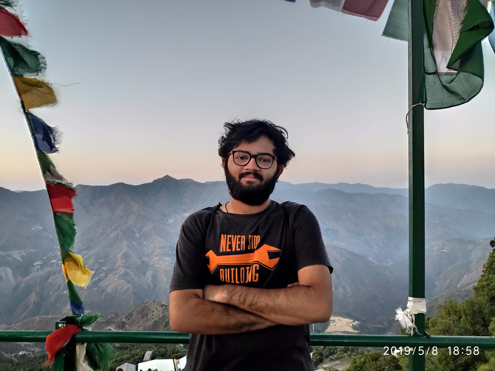

## Viraj Mohile

Hi! I am a junior year undergrad from **National Institute of Techology, Surat**. Highly oriented, to-the-point individual who has an expireience of managing small to super big events, a team of more than 50 students, and mentoring directly a group of 20-24 highly motivated individuals in the field of Finance, Business Development and Entrepreneurship at college level. An avid reader following likes of **Salman Rushdie**, **Ayn Rand**, **Nassim Nicholas Taleb**.

I was highly motivated by the works of **Albert Einstein** as a high school grad who taught me how imagination, perseverance and logic when combined can help mankind achieve great things. Since I have an ardent passion for the world of finance, I am a regular follower of **Robert Shiller** and **Ray Dalio**. When I am not reading, programming or working, I love to travel. I love to connect to local people, know about their traditions and culture whenever I visit some place. My dream is to travel the world until I turn 30!

This is my online resume. [GitHub](https://github.com/high-in-entropy/resume2)

**---**

## Education

Year | Examination | University/Board | Institute | CGPA/%
-----|-------|--------|------|-------
2014-'15 | Matriculation  | CBSE | Kendriya Vidyalaya | 10 CGPA
2016-'17 | Higher Secondary | CBSE | Kendriya Vidyalaya | 90.8%
2017-'21 | BTech (expected '21) | SVNIT, Surat | SVNIT, Surat | 7.42 (as of 5th semester)

**---**

## Career Interest

I aim to have a career in the field of **Finance**. I have a good kowledge and understanding of **Portfolio Optimization**, **Risk Management**, **Algorithmic Trading** and **Economics**. Since my freshman year, I have been extensively working with **Python**. I have solved a few real world problems using **Data Analytics**, **Machine Learning**, as well as pure simple **statistics**. My goal is to work in the ever transforming world of **Data Science aided Finance**. 

**---**

## Experience 

### 1. Cutting Edge Visionaries (CEV), NIT Surat
* **Head, Aryavarta - The Finance, Business Development and Entrepreneurship division at CEV**
*Since Jan 2020*

Lead the entire division of the student chapter. My goal is to mentor projects,
help members discover interests in the field by conducting workshops and talks,
study jams, discussions and help them recognize the importance and demand of
data skills in finance.

* **Director, Overall Operation**
*April 2019*

CEV provides a common platform for students having interests
in varied range of fields. My goal is to manage the overall
functioning of the student chapter and make sure it doesn’t
derail off its objectives. Help conducting winter schools,
courses, professors’ talks, etc. 

* **Junior Executive**
*April 2018 - April 2019*

Help CEV conduct, publicize, and plan its events.
Actively take part in projects, study jams organized and led by
former heads.

### 2. Freeco, An Ed-Tech startup based in NIT Jalandhar
*Feb 2019 - April 2019*
**Intern, Data Analyst**
An educational start-up. Perform statistical analyses, Report generation,
Deploying analytical web applications, Automating some of the
organization’s bulky, time taking tasks using python and make
processes more efficient.

### 3. NITovators, An Ed-Tech startup based in NIT Jalandhar
*July 2018 - December 2018*
**Intern, General Management** 
An educational startup. Attract investors to gain funding. Social Media
Marketing. Student Relations Manager. Organize orientation programs over Zoom Meetings for over
200+ prospective students as well as interns. B2B Advertising.

**---**
